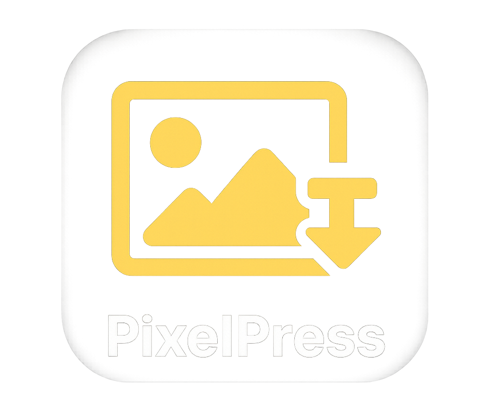

# PixelPress - Image Compression Tool

A powerful desktop application for batch image compression and format conversion built with Electron, Node.js, and Sharp.

## 📥 Download

### 🚀 **[⬇️ Download PixelPress v1.0.0 for Windows](https://github.com/ahmadalasiri/pixelpress/releases/download/v1.0.0/PixelPress-Setup-v1.0.0.exe)**

_86.3 MB | Windows 10+ | Free & Open Source_

**Quick Install:** Download → Run → Click "More info" → "Run anyway" → Follow installer

**Alternative:** [View all releases](https://github.com/ahmadalasiri/pixelpress/releases) | [Download instructions](DOWNLOAD_INSTRUCTIONS.md)



## ✨ Features

### 🎯 Core Functionality

- **Batch Processing**: Process entire folders of images recursively
- **Drag & Drop**: Simply drag and drop individual or multiple images
- **Multiple Formats**: Convert to WebP, AVIF, JPEG, or PNG
- **Smart Compression**: Automatically compress images to meet size requirements
- **Folder Structure**: Maintains original folder hierarchy in output
- **Flexible Input**: Choose between folder processing or individual file selection

### 📊 Advanced Features

- **Detailed Summary**: Complete compression report with before/after sizes and percentages
- **Progress Tracking**: Real-time progress updates with current file names
- **Smart Validation**: Intelligent form validation with helpful error messages
- **File Size Control**: Minimum 1 KB limit with no upper restriction

### 🎨 User Experience

- **Dark Mode**: Beautiful dark theme with smooth transitions
- **Multi-Language**: Full Arabic and English language support with RTL layout
- **Modern UI**: Clean, intuitive interface with smooth animations
- **Cross-Platform**: Works on Windows, macOS, and Linux
- **Auto-Save Preferences**: Remembers your theme and language choices

## 🚀 Quick Start

### Prerequisites

- Node.js 16 or higher
- npm or yarn package manager

### Installation

1. Clone the repository:

```bash
git clone https://github.com/ahmadalasiri/pixelpress.git
cd pixelpress
```

2. Install dependencies:

```bash
npm install
```

3. Run the application:

```bash
npm start
```

### Development Mode

For development with auto-reload:

```bash
npm run watch
```

This uses nodemon to automatically restart the app when files change.

## 📖 Usage

### 🎯 Two Ways to Add Images

#### Method 1: Drag & Drop (Recommended)

1. **Drag Images**: Simply drag and drop image files directly into the blue dashed area
2. **Multiple Selection**: Drop multiple images at once or use the "Browse" button in the drop zone
3. **File Management**: View selected files with sizes, remove individual files, or clear all

#### Method 2: Folder Processing

1. **Select Source Folder**: Click "Browse" next to "Source Folder" and choose the folder containing your images
2. **Recursive Processing**: All images in subfolders will be processed automatically

### ⚙️ Configuration

1. **Select Destination Folder**: Click "Browse" next to "Destination Folder" (Required)
2. **Choose Target Format**: Select your desired output format:
   - **WebP** (.webp) - Best compression, modern browsers
   - **AVIF** (.avif) - Next-gen format, excellent compression
   - **JPEG** (.jpeg) - Universal compatibility
   - **PNG** (.png) - Lossless compression
3. **Set Maximum Size**: Enter the maximum file size in KB (minimum 1 KB, no upper limit)
4. **Start Processing**: Click "Start Processing" and watch the real-time progress

### 🎨 Interface Features

- **🌙 Dark Mode**: Click the sun/moon icon to toggle between light and dark themes
- **🌍 Language**: Switch between English and Arabic (العربية) with full RTL support
- **📊 Summary Report**: After processing, view detailed compression statistics
- **💾 Auto-Save**: Your theme and language preferences are automatically saved

### Example Workflows

#### Drag & Drop Workflow

```
1. Drag 5 photos into the drop zone
2. Select destination: C:\Users\Pictures\Compressed
3. Format: WebP, Max Size: 300 KB
4. Click "Start Processing"
5. View summary: 5 processed, 2.1 MB saved, 65% avg compression
```

#### Folder Processing Workflow

```
Source: C:\Users\Pictures\Photos (contains 50 images in subfolders)
Destination: C:\Users\Pictures\Compressed
Format: AVIF, Max Size: 200 KB
Result: All 50 images converted with folder structure maintained
```

## 🛠️ Development

### Running in Development Mode

```bash
# Standard development mode
npm run dev

# Auto-reload development mode (recommended)
npm run watch
```

- `npm run dev`: Opens the application with developer tools enabled
- `npm run watch`: Uses nodemon for automatic restart when files change

### Project Structure

```
pixelpress/
├── main.js              # Electron main process
├── preload.js           # Secure IPC bridge
├── index.html           # User interface with dark mode support
├── renderer.js          # UI logic, drag-drop, and theme management
├── imageProcessor.js    # Image processing with Sharp
├── i18n.js              # Internationalization (English/Arabic)
├── package.json         # Dependencies and build config
├── assets/              # Application icons
├── .gitignore           # Git ignore rules
└── README.md           # This file
```

### Key Technologies

- **Electron**: Desktop application framework
- **Sharp**: High-performance image processing
- **Node.js**: Backend runtime with IPC communication
- **HTML/CSS/JS**: Modern web technologies with CSS variables for theming
- **Internationalization**: Custom i18n system with RTL support
- **Nodemon**: Development auto-reload functionality

## 📦 Building for Distribution

### Build for All Platforms

```bash
npm run build
```

### Platform-Specific Builds

```bash
# Windows
npm run build:win

# macOS
npm run build:mac

# Linux
npm run build:linux
```

Built applications will be available in the `dist/` folder.

### Build Requirements

- **Windows**: No additional requirements
- **macOS**: Requires macOS to build .dmg files
- **Linux**: Works on any platform for AppImage

## 🎯 Supported Image Formats

### Input Formats

- JPEG (.jpg, .jpeg)
- PNG (.png)
- WebP (.webp)
- AVIF (.avif)
- TIFF (.tiff, .tif)
- BMP (.bmp)
- GIF (.gif)

### Output Formats

- WebP (.webp) - Recommended for web
- AVIF (.avif) - Next-generation format
- JPEG (.jpeg) - Universal compatibility
- PNG (.png) - Lossless compression

## ⚙️ Configuration

### Default Settings

- **Target Format**: WebP
- **Maximum Size**: 500 KB (minimum 1 KB, no upper limit)
- **Quality Range**: 90-10 (auto-adjusted)
- **Resize Strategy**: Proportional scaling when needed
- **Theme**: Light mode
- **Language**: English (with Arabic support)

### Compression Algorithm

1. Start with 90% quality
2. Reduce quality in steps if file too large
3. Resize image dimensions if quality reduction insufficient
4. Maintain aspect ratio throughout process

## 🔧 Troubleshooting

### Common Issues

**"No supported image files found"**

- Ensure your source folder contains supported image formats
- Check that you have read permissions for the source folder

**"Source or destination folder does not exist"**

- Verify both folders exist and are accessible
- Ensure you have write permissions for the destination folder

**Processing fails on specific images**

- Some corrupted images may be skipped automatically
- Check the console for detailed error messages

**Application won't start**

- Ensure Node.js 16+ is installed
- Run `npm install` to install dependencies
- Try `npm run dev` for debugging information

### Performance Tips

- **Large batches**: Process in smaller batches for better responsiveness
- **SSD storage**: Use SSD drives for faster processing
- **Memory**: Ensure sufficient RAM for large images
- **Format choice**: WebP offers best compression/quality balance
- **Drag & Drop**: Use drag & drop for better performance with individual files
- **Dark Mode**: Use dark mode for comfortable extended usage

## 🤝 Contributing

1. Fork the repository
2. Create a feature branch: `git checkout -b feature-name`
3. Make your changes and test thoroughly
4. Commit your changes: `git commit -am 'Add feature'`
5. Push to the branch: `git push origin feature-name`
6. Submit a pull request

### Development Guidelines

- Follow existing code style and formatting
- Add comments for complex logic
- Test on multiple platforms when possible
- Update documentation for new features

## 📄 License

This project is licensed under the MIT License - see the [LICENSE](LICENSE) file for details.

## 🙏 Acknowledgments

- [Sharp](https://sharp.pixelplumbing.com/) - Amazing image processing library
- [Electron](https://www.electronjs.org/) - Cross-platform desktop apps
- [Node.js](https://nodejs.org/) - JavaScript runtime

## 📞 Support

If you encounter any issues or have questions:

1. Check the [Issues](https://github.com/ahmadalasiri/pixelpress/issues) page
2. Create a new issue with detailed information
3. Include your OS, Node.js version, and error messages

---

**Made with ❤️ for efficient image processing**
